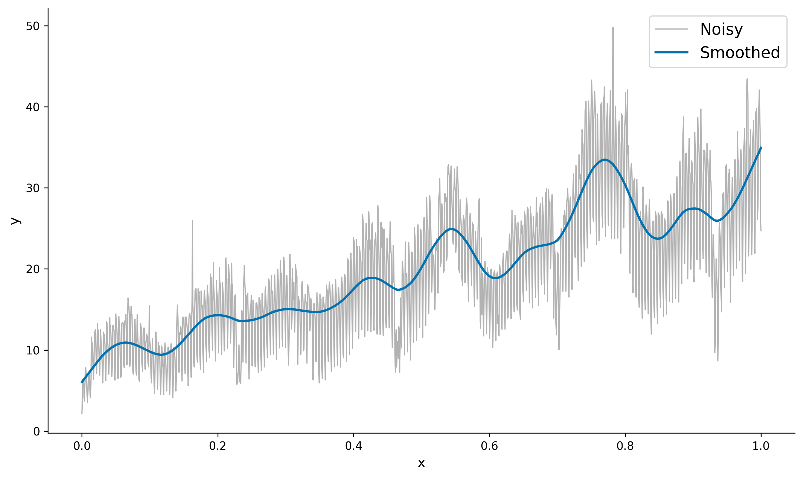

# Supsmu

Supsmu implements Friedman's SuperSmoother algorithm - a time series smoother that uses
cross-validation to automatically select optimal spans for local linear regression.



## Installation

TBC

## Python Example
Minimal example using dummy data:

```Python
import numpy as np
from supsmu import supsmu

x = np.linspace(0, 1, 100, dtype=np.float64)
# Dummy data - a basic sine wave
y = np.sin(2 * 2 * np.pi * x)
noise = np.random.normal(0, 0.2, 100)
y_noisy = y + noise

y_smooth = supsmu(x, y_noisy, periodic=True)
```

## Additional Information
The implementation is designed to closely match the outputs of the Fortran version (available in R),
however there may still exist some inconsistencies.


## References
[1] J. H. Friedman, "A Variable Span Smoother", SLAC National Accelerator Laboratory (SLAC),
Menlo Park, CA (United States), SLAC-PUB-3477; STAN-LCS-005, Oct. 1984. doi: 10.2172/1447470.
